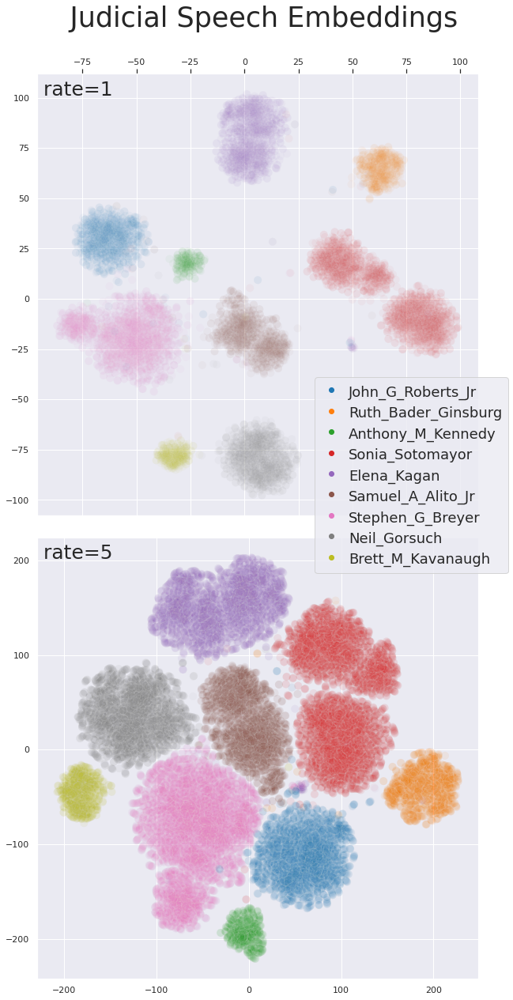

# rd-diarization

Code repository for paper **Diarization of Legal Proceedings. Identifying and Transcribing Judicial Speech from Recorded Court Audio**

We focus on the task of audio diarization in the legal domain, specifically on the Supreme Court of the United States Oral Arguments, accessed through the [Oyez Project](https://www.oyez.org/). In this work utilize a [speech embedding network](https://github.com/resemble-ai/Resemblyzer) (referred to as *Voice Encoder*) pre-trained by Resemble.AI with the [Generalized End-to-End Loss](https://google.github.io/speaker-id/publications/GE2E/) to encode speech into d-vectors and a pre-defined reference audio library based on annotated data. We find that by encoding reference audio for speakers and full proceedings and computing similarity scores we achieve a 13.8% Diarization Error Rate for speakers covered by the reference audio library on a held-out test set.

The documentation outlines reproducing our experiments on the SCOTUS oral arguments. The `SCOTUS` folder contains the code to pull case audio and transcriptions from the [Oyez API](https://github.com/walkerdb/supreme_court_transcripts) and convert the mp3 to wav files (uses `ffmpeg`), as well as convert the transcriptions to RTTM format. The `RDSV` folder houses the case embedding and diarization code, as well as [our fork of the Voice Encoder](https://github.com/JeffT13/VoiceEncoder) as a submodule. Each of these folders have their own README detailing their content. Finally, there is the `script` folder which holds the script calls as SLURM jobs, and in our `plots` folder there is a notebook analyzing the final results and generating plots, which was ran locally. 

## Set-Up

After cloning this repository, make sure to fetch the files for the Voice Encoder submodule (`git submodule update --init`). Our implementation assumes you will be running your jobs from directly inside the git repo, and that you have directories ready for the initial steps. These are gone through in more detail in the `SCOTUS` and `RDSV` folders where they apply, but to start one should have a `data` directory outside of this repo which contains an `audio`,`transcript` and `rttm` folder. This can be seen in the `RDSV/param.py` file. Once this is complete and enviornment has been created, you are ready to reproduce our experiments. 

    
### Requirements

You can build your env with the `requirements.txt` file. The only packages that are outside of typical data science packages are:

    - PyTorch
    - librosa
    - webrtcvad
    - pyannote.audio
  
You can run the `RDSV/env_check.py` script to ensure the enviorment has been set up correctly.

# Performance

## Acknowledgements

Tremendous thanks to Professor Aaron Kaufman, Professor Michael Picheny and Professor Brian McFee for their contributions to the paper as well as their guidance and feedback on the implementation. We also thank New York University's High-Performance Computing Clusters for the computational resources and Dr. Sergey Samsonau for his help in utilizing these resources. Finally, we thank Resemble.AI for their open-source contributions to speech research and the Oyez Project for the service they provide in making Supreme Court data available. 
